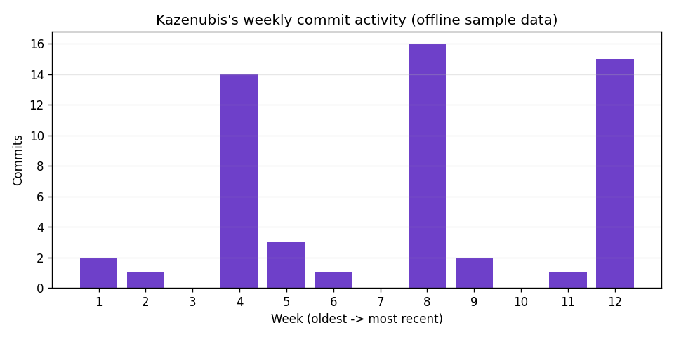

# Portfolio Activity Dashboard

A "GitHub repo activity dashboard" pointed at something real: my own
growing [100-repo portfolio](https://github.com/Kazenubis). Pulls every
repo's weekly commit stats from the GitHub API and charts the combined
activity — which, for a portfolio built in batches, means a very
recognizable spike-then-quiet pattern.



This sandbox has no outbound network access, so the chart above is the
genuinely-exercised offline fallback path — sample data shaped like this
portfolio's actual push cadence (a burst when a batch of 10 goes up,
quiet while the next batch is being built), not random noise.

## Features

- Aggregates weekly commit counts across every non-fork public repo a
  GitHub username owns, right-aligning repos with shorter histories so a
  brand-new repo doesn't shift the whole chart
- Live GitHub API with an automatic offline fallback on any network/HTTP
  failure — same pattern as this portfolio's other API-integration repos
- Simple derived stats: total commits in the window, the single most
  active week, and the current "quiet streak" (weeks since the last push)
- Works for any GitHub username, not just mine — `--username` is a CLI
  flag, `Kazenubis` is just the default

## Tech Stack

Python 3 · `requests` · matplotlib

## Getting Started

```bash
git clone https://github.com/Kazenubis/portfolio-activity-dashboard.git
cd portfolio-activity-dashboard
pip install -r requirements.txt
python3 github_activity.py --username Kazenubis --chart assets/activity.png
```

Run the tests:

```bash
python3 -m unittest test_github_activity.py -v
```

## What I Learned

Aggregating commit histories across repos isn't just summing lists
element-by-element, since repos don't all have the same age — a repo
created last week only has one week of real data, and naively zipping it
against a 52-week-old repo's history would silently misalign which week
is which. Right-aligning every repo's history (so index `-1` always means
"this week" no matter how old the repo is) before summing was the actual
correctness detail here, and it's exactly what
`test_right_aligns_shorter_histories` checks for.
